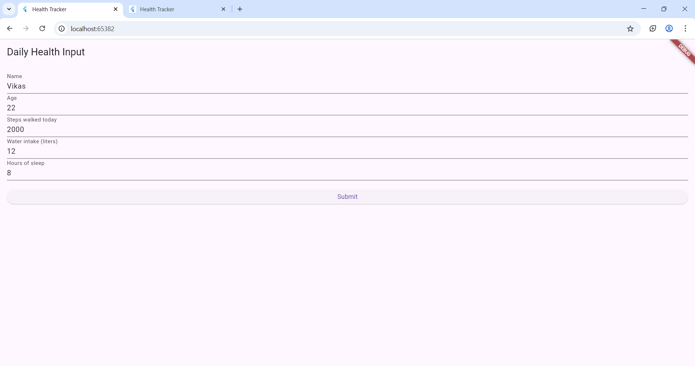
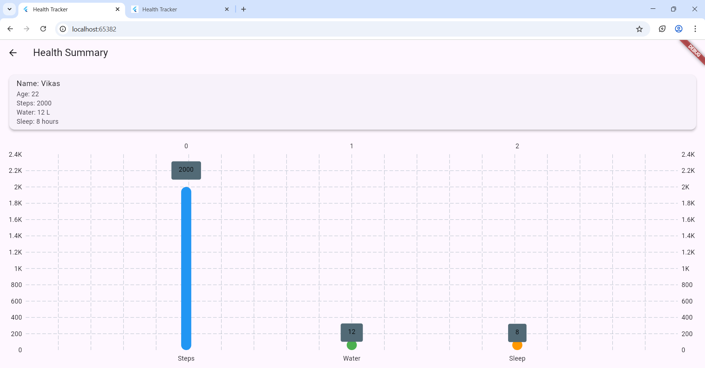

# health_tracker
Health Tracker is a simple Flutter-based mobile and web application designed to help users monitor and visualize their daily health data. The app provides an easy-to-use interface to input key health metrics and displays a visual summary in the form of a bar chart for quick analysis.
Key Features:
1.Daily Health Input Form:Users can enter essential health data each day, including:
Name,Age,Steps walked,Water in take (in liters),Hours of sleep
2.Data Validation:All fields are validated to ensure correct and meaningful inputs.
3.Summary Screen:After submitting the form, users are navigated to a summary screen displaying:Name and Age,Daily steps, water intake, and hours of sleep,
Visual representation of data using a bar chart for easy comparison.
4.Interactive Bar Chart:The chart allows users to quickly see which metrics are higher or lower compared to others, helping them maintain a balanced daily routine.
5.Cross-Platform Support:The app works seamlessly on mobile devices and web browsers using Flutter.

# App Screenshots

#Commands to run the project
 cd health_tracker
 flutter run -d chrome
 
This project is a starting point for a Flutter application.
A few resources to get you started if this is your first Flutter project:
- [Lab: Write your first Flutter app](https://docs.flutter.dev/get-started/codelab)
- [Cookbook: Useful Flutter samples](https://docs.flutter.dev/cookbook)

For help getting started with Flutter development, view the
[online documentation](https://docs.flutter.dev/), which offers tutorials,
samples, guidance on mobile development, and a full API reference.
